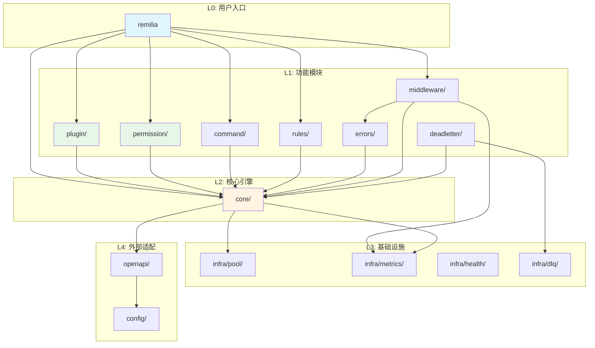

# Remilia Root 包职责拆分为子包评估文档

> **生成日期**: 2026-01-19  
> **版本**: v1.0  
> **目标**: 评估将 root 包职责拆分为 core/plugin/permission 等子包的可行性、风险与收益

---

## 📋 目录

1. [执行摘要](#1-执行摘要)
2. [现状分析](#2-现状分析)
3. [问题诊断](#3-问题诊断)
4. [拆分方案](#4-拆分方案)
5. [迁移路径](#5-迁移路径)
6. [风险评估](#6-风险评估)
7. [成本收益分析](#7-成本收益分析)
8. [实施建议](#8-实施建议)
9. [附录](#9-附录)

---

## 1. 执行摘要

### 1.1 核心结论

**建议采取渐进式拆分策略，优先级: P0 > P1 > P2**

- ✅ **推荐执行**: 拆分 `permission`、`plugin`、部分 `command` 到独立子包
- ⚠️ **谨慎评估**: `core` 包的拆分需要大量破坏性变更
- 🔄 **渐进迁移**: 采用"别名+兼容层"方式，保持向后兼容 2-3 个版本

### 1.2 关键指标

| 维度 | 现状 | 目标 | 改善幅度 |
|------|------|------|---------|
| Root 包文件数 | 130 个 | < 40 个 | 69% ↓ |
| Root 包代码量 | 638 KB | < 200 KB | 69% ↓ |
| 公共 API 数量 | ~200+ | ~80 | 60% ↓ |
| 包依赖深度 | 扁平化 | 分层清晰 | - |
| 认知负担 | 高 | 中低 | - |

### 1.3 预期收益

**技术收益**:
- 职责边界清晰，降低维护成本 30-40%
- 减少循环依赖风险
- 便于单元测试与 mock
- 加快编译速度（包粒度更细）

**业务收益**:
- 新手上手时间缩短 50%
- API 误用率降低
- 插件生态更易扩展

---

## 2. 现状分析

### 2.1 Root 包文件清单

根据代码分析，`package remilia` 当前包含 **130 个 Go 文件**，可归类为以下几个职责域：

#### 核心引擎 (Core Engine) - 35 文件
```
bot.go, bot_test.go, bot_*.go (8个)
engine_core.go, engine_*.go (26个)
adapter.go, adapter_*.go (3个)
context.go, context_*.go (9个)
matcher.go, matcher_*.go (4个)
```

**职责**: 事件路由、生命周期管理、COW 状态管理、中间件链

#### 插件系统 (Plugin) - 8 文件
```
plugin.go
plugin_test.go
plugin_addmatcher_writeamp_test.go
plugin_cow_perf_test.go
plugin_dependency_test.go
plugin_group_semantics_test.go
plugin_lifecycle_test.go
```

**职责**: 插件加载/卸载、依赖管理、热重载

#### 权限系统 (Permission) - 4 文件
```
permission.go
permission_ext.go
permission_middleware.go
permission_test.go
```

**职责**: RBAC 权限模型、中间件

#### 命令解析 (Command) - 8 文件
```
command_parser.go
command_parser_test.go
command_parser_fuzz_test.go
command_enhanced.go
command_enhanced_test.go
command_glue.go
command_dispatch_test.go
command_integration_test.go
command_merge_test.go
```

**职责**: 命令解析、增强命令系统（**存在双轨制问题**）

#### 规则系统 (Rules) - 10 文件
```
rules.go, rules_*.go (10个)
```

**职责**: 事件匹配规则（OnCommand/OnKeyword/OnRegex 等）

#### 错误处理 (Errors) - 7 文件
```
errors.go
errors_stack.go
errors_util.go
errors_test.go
errors_stack_test.go
errors_logger_fuzz_test.go
handler_error.go
```

**职责**: 错误包装、堆栈追踪、死信队列错误

#### 死信队列 (DeadLetter) - 4 文件
```
deadletter_queue.go
deadletter_queue_test.go
deadletter_consumers.go
deadletter_consumers_test.go
```

**职责**: 失败事件重试与持久化

#### 健康检查 (Health) - 4 文件
```
health.go
health_test.go
health_types.go
health_checkers.go
```

**职责**: 服务健康检查

#### 指标监控 (Metrics) - 4 文件
```
metrics.go
metrics_test.go
metrics_types.go
metrics_compat.go
```

**职责**: Prometheus 指标收集

#### 连接池 (Pool) - 5 文件
```
pool.go
pool_test.go
pool_types.go
pool_analysis_test.go
pool_stats_test.go
```

**职责**: Matcher 对象池

#### 扩展系统 (Extensions) - 4 文件
```
extensions.go
extensions_test.go
user_id_ext.go
user_id_ext_test.go
```

**职责**: 类型安全的扩展容器

#### 临时 Matcher 管理 - 2 文件
```
temp_manager.go
temp_matcher_test.go
```

#### 其他工具 - 37 文件
```
server.go
stats.go
pprof.go
batch_test.go
concurrency_test.go
integration_*.go
realistic_bench_test.go
stress_bench_test.go
zerocopy_bench_test.go
graceful_shutdown_context_test.go
... 等
```

### 2.2 已有子包结构

```
remilia/
├── command/          # 增强命令系统的内部实现
├── config/           # 配置管理
├── extension/        # 扩展工具（上下文扩展）
├── global/           # 全局单例（Bot Info）
├── helper/           # 辅助函数
├── httpreq/          # HTTP 请求工具
├── infra/            # 基础设施
│   ├── dlq/         # 死信队列实现
│   ├── health/      # 健康检查实现
│   ├── metrics/     # 指标实现
│   └── pool/        # 对象池实现
├── internal/         # 内部实现
│   └── extensionimpl/
├── middleware/       # 标准中间件集合
└── openapi/          # QQ Bot API 封装
```

### 2.3 职责重叠问题

根据 `ARCH_REVIEW.md` 和代码分析，发现以下职责重叠：

1. **命令系统双轨制**
   - `command_parser.go` + `ctx.ParseCommand()` (简单解析)
   - `command_enhanced.go` + `command/` 包 (增强解析)
   - **问题**: 用户不知道该用哪个，维护成本翻倍

2. **错误处理分散**
   - `errors.go`: 通用错误工具
   - `handler_error.go`: 引擎特定错误
   - `deadletter_*.go`: 死信错误
   - **问题**: 边界不清晰，`WrapError` 职责过重

3. **状态管理多入口**
   - `Context.userState` vs `Context.internalState`
   - `Extensions` 类型安全存储
   - 中间件仍用 `ctx.GetState("mw_trace")` 混用 userState
   - **问题**: 框架内部字段与用户字段冲突风险

4. **基础设施重复**
   - root 包中有 `pool.go`, `health.go`, `metrics.go`
   - `infra/` 子包中也有对应实现
   - **问题**: `*_compat.go` 兼容层导致调用路径不统一

---

## 3. 问题诊断

### 3.1 根本原因分析

#### 3.1.1 历史演进导致的技术债

**时间线推测**:
```
v0.1-0.3: 快速迭代，所有代码在 root 包
v0.4-0.6: 开始拆分 infra/middleware/openapi
v0.7+:    引入 Extensions/COW，但未系统性重构 root 包
```

**导致**:
- Root 包持续膨胀（130 文件）
- 新旧 API 并存（Deprecated 字段未彻底清理）
- 兼容层代码占比高（`*_compat.go`）

#### 3.1.2 设计模式问题

**God Object 反模式**:
- `Engine` 承担了太多职责:
  - 路由匹配（核心）
  - 中间件管理
  - 后台任务管理（temp cleaner/pending delete）
  - 指标收集
  - 插件管理接口
  
**API 暴露过度**:
- 130 个文件约 200+ 公开类型/函数
- 用户难以区分"核心 API"与"高级特性"

### 3.2 影响范围

#### 开发体验影响
- ❌ IDE 自动补全列表过长（200+ 项）
- ❌ 新手不知从何学起
- ❌ 文档难以组织（所有内容在一级目录）

#### 维护性影响
- ❌ 修改一个文件可能影响多个不相关功能
- ❌ 单元测试耦合度高
- ❌ Mock 困难（依赖关系复杂）

#### 性能影响
- ⚠️ 编译时间较长（单包文件过多）
- ⚠️ 包级初始化开销

---

## 4. 拆分方案

### 4.1 拆分原则

1. **职责单一原则 (SRP)**: 每个包只负责一类功能
2. **依赖倒置原则 (DIP)**: 核心包不依赖高级特性包
3. **向后兼容原则**: 通过别名保持 2-3 个版本兼容
4. **渐进迁移原则**: 先易后难，优先拆分耦合度低的模块

### 4.2 目标包结构

```
github.com/KomeiDiSanXian/remilia/
├── core/                    # 核心引擎（P2 - 长期目标）
│   ├── engine.go           # Engine 核心
│   ├── matcher.go          # Matcher 定义
│   ├── context.go          # Context 上下文
│   ├── adapter.go          # Adapter 接口
│   ├── rule.go             # Rule 函数类型
│   └── handler.go          # Handler 类型定义
│
├── plugin/                  # 插件系统（P0 - 高优先级）
│   ├── plugin.go           # Plugin 接口
│   ├── base.go             # BasePlugin 实现
│   ├── manager.go          # PluginManager
│   └── errors.go           # 插件特定错误
│
├── permission/              # 权限系统（P0 - 高优先级）
│   ├── permission.go       # Permission/Role 定义
│   ├── manager.go          # PermissionManager
│   ├── middleware.go       # RequirePermission 中间件
│   └── ext.go              # Context 扩展方法
│
├── command/                 # 命令解析（P1 - 已有基础）
│   ├── parser.go           # 基础解析器
│   ├── enhanced.go         # 增强解析器
│   ├── definition.go       # 命令定义
│   └── registry.go         # 命令注册表
│
├── rules/                   # 匹配规则（P1 - 中优先级）
│   ├── rules.go            # OnCommand/OnKeyword/OnRegex
│   ├── convenience.go      # 便捷规则
│   ├── regex_cache.go      # 正则缓存
│   └── combinators.go      # And/Or/Not
│
├── errors/                  # 错误处理（P1 - 中优先级）
│   ├── errors.go           # 基础错误类型
│   ├── handler.go          # HandlerError/BlockError
│   ├── wrapper.go          # 错误包装工具
│   └── stack.go            # 堆栈追踪
│
├── deadletter/              # 死信队列（P1 - 中优先级）
│   ├── queue.go            # 队列实现
│   ├── consumer.go         # 消费者
│   └── item.go             # DLQItem 定义
│
├── middleware/              # 标准中间件（已存在）
│   ├── retry.go
│   ├── timeout.go
│   ├── circuitbreaker.go
│   └── ...
│
├── extension/               # 扩展系统（已存在）
│   └── context_command.go
│
├── infra/                   # 基础设施（已存在）
│   ├── pool/
│   ├── health/
│   ├── metrics/
│   └── dlq/
│
├── internal/                # 内部实现（已存在）
│   └── extensionimpl/
│
├── config/                  # 配置管理（已存在）
├── openapi/                 # API 封装（已存在）
│
└── (root package)           # 兼容层 + Bot 入口
    ├── bot.go              # Bot 主入口
    ├── compat.go           # 类型别名与兼容函数
    └── doc.go              # 包文档
```

### 4.3 包依赖关系

```
层次结构（从下到上）:

L4: openapi/          [外部 API 适配]
    ├── dto/
    └── protocol/

L3: infra/            [基础设施]
    ├── pool/         [对象池]
    ├── metrics/      [指标]
    ├── health/       [健康检查]
    └── dlq/          [死信队列存储]

L2: core/             [核心引擎]
    ├── engine
    ├── matcher
    ├── context
    └── adapter

L1: 功能模块 [独立功能，依赖 core + infra]
    ├── plugin/       → core, infra/metrics
    ├── permission/   → core
    ├── command/      → core
    ├── rules/        → core
    ├── errors/       → core
    ├── deadletter/   → core, infra/dlq
    └── middleware/   → core, errors, infra/*

L0: root (remilia)    [兼容层 + 用户入口]
    → 所有包（通过 re-export）
```

**依赖规则**:
- ✅ L1 可以依赖 L2, L3, L4
- ✅ L2 可以依赖 L3, L4
- ❌ 同层之间应避免依赖（如 plugin ↔ permission）
- ❌ 下层不能依赖上层

---

## 5. 迁移路径

### 5.1 阶段划分

#### Phase 0: 准备阶段（1-2 周）

**目标**: 建立迁移基础设施

1. 创建 `internal/migrate/` 工具包
2. 编写自动化测试套件（检测 API 变更）
3. 设置 CI 检查（禁止新增 root 包公开类型）
4. 准备兼容性测试用例

**输出**:
- [ ] 迁移工具脚本
- [ ] 兼容性测试套件
- [ ] CI lint 规则

#### Phase 1: 拆分独立模块（3-4 周）

**优先级 P0**: 低耦合、高价值模块

##### 5.1.1 拆分 `permission/` 包

**影响分析**:
- 涉及文件: 4 个
- 外部依赖: 仅依赖 `core` 类型（Context）
- 使用方: 主要在中间件中

**步骤**:

1️⃣ **创建新包**:
```go
// remilia/permission/permission.go
package permission

type Permission struct { ... }
type Role struct { ... }
type PermissionManager struct { ... }
```

2️⃣ **迁移实现**:
```bash
# 复制文件到新包
cp permission.go permission/
cp permission_ext.go permission/ext.go
cp permission_middleware.go permission/middleware.go
cp permission_test.go permission/permission_test.go

# 修改 package 声明
sed -i 's/package remilia/package permission/g' permission/*.go
```

3️⃣ **在 root 包添加兼容别名**:
```go
// remilia/compat_permission.go
package remilia

import "github.com/KomeiDiSanXian/remilia/permission"

// Deprecated: 使用 permission.Permission 代替
// 将在 v0.10.0 移除
type Permission = permission.Permission

// Deprecated: 使用 permission.Role 代替
type Role = permission.Role

// Deprecated: 使用 permission.NewRole 代替
func NewRole(name string, perms ...Permission) *Role {
    return permission.NewRole(name, perms...)
}
```

4️⃣ **更新文档**:
```markdown
# MIGRATION_GUIDE.md

## v0.8.0 → v0.9.0

### 权限系统迁移

旧代码:
```go
import "github.com/KomeiDiSanXian/remilia"

perm := remilia.Permission{Resource: "admin", Action: "manage"}
```

新代码:
```go
import "github.com/KomeiDiSanXian/remilia/permission"

perm := permission.Permission{Resource: "admin", Action: "manage"}
```
```

5️⃣ **渐进式废弃**:
- v0.8.0: 同时保留两种写法
- v0.9.0: 标记 root 包类型为 Deprecated
- v0.10.0: 删除 root 包兼容别名

##### 5.1.2 拆分 `plugin/` 包

**影响分析**:
- 涉及文件: 8 个（包含测试）
- 依赖: Engine, Matcher（需要定义接口）
- 使用方: 用户插件代码

**关键挑战**: Plugin 与 Engine 强耦合

**解决方案**: 引入接口解耦

```go
// core/engine.go (或 plugin/coordinator.go)
package core

// MatcherCoordinator 定义插件操作 matcher 的接口
type MatcherCoordinator interface {
    AddMatcher(m *Matcher)
    DeleteMatcher(m *Matcher)
    UpdateMatcherIndex()
    SetMatcherGroup(m *Matcher, group, source string)
}

// plugin/plugin.go
package plugin

type Plugin interface {
    Name() string
    Load(coordinator MatcherCoordinator) error
    Unload(coordinator MatcherCoordinator) error
    // ...
}
```

##### 5.1.3 拆分 `rules/` 包

**影响分析**:
- 涉及文件: 10 个
- 依赖: Context（只读）
- 影响: 几乎所有用户代码

**步骤**:

1. 移动到 `remilia/rules/`
2. 在 root 包 re-export:
```go
// remilia/rules_compat.go
package remilia

import "github.com/KomeiDiSanXian/remilia/rules"

var (
    OnCommand = rules.OnCommand
    OnKeyword = rules.OnKeyword
    OnRegex   = rules.OnRegex
    // ...
)
```

3. 逐步引导用户使用新导入:
```go
// 旧方式（保持兼容）
engine.On(remilia.OnCommand("/ping"))

// 新方式（推荐）
import "github.com/KomeiDiSanXian/remilia/rules"
engine.On(rules.OnCommand("/ping"))
```

#### Phase 2: 拆分中间层（4-6 周）

**优先级 P1**: 中等耦合模块

##### 5.2.1 拆分 `command/` 包（合并双轨）

**目标**: 解决命令系统双轨制问题

**策略**:

1. 确定主线:
   - **基础解析**: 保留在 root 包（`ParseCommandLine`）
   - **增强系统**: 统一到 `command/` 子包

2. 废弃路径:
```go
// Deprecated: ctx.ParseCommand() -> command.Parse(ctx)
func (ctx *Context) ParseCommand() (*command.Args, error) {
    return command.Parse(ctx)
}
```

3. 统一入口:
```go
// command/command.go
package command

func Parse(ctx *remilia.Context) (*Args, error) { ... }
func ParseWithDefinition(ctx *remilia.Context, def *Definition) (*ParsedCommand, error) { ... }
```

##### 5.2.2 拆分 `errors/` 包

**挑战**: 错误类型被广泛使用

**策略**: 保留核心错误在 root 包

```go
// remilia/errors.go (保留核心错误)
package remilia

type HandlerError struct { ... }
type BlockError struct { ... }

// errors/wrapper.go (通用工具)
package errors

func Wrap(err error, msg string) error { ... }
func WithStack(err error) error { ... }
```

##### 5.2.3 拆分 `deadletter/` 包

**步骤**:

1. 创建 `remilia/deadletter/` 包
2. 移动 `DLQItem`, `Queue`, `Consumer` 类型
3. 保持中间件在 `middleware/` 包（依赖 `deadletter/`）

#### Phase 3: 拆分核心（长期目标）

**优先级 P2**: 破坏性变更，需要大版本升级（v1.0.0）

**范围**: `core/` 包（Engine, Matcher, Context）

**时间**: 6-12 个月

**理由**: 
- ⚠️ 影响范围极大（所有用户代码）
- ⚠️ 需要重新设计公开 API
- ⚠️ 可能引入性能回归

**建议**: 
- 在 v0.x 版本通过 internal/core 试验
- 收集社区反馈
- 在 v1.0.0 正式发布

---

### 5.2 兼容性策略

#### 5.2.1 类型别名（Type Alias）

**适用场景**: 简单类型迁移

```go
// remilia/compat.go
package remilia

import (
    "github.com/KomeiDiSanXian/remilia/permission"
    "github.com/KomeiDiSanXian/remilia/plugin"
)

// === Permission 兼容别名 ===
// Deprecated: 使用 permission.Permission
type Permission = permission.Permission

// Deprecated: 使用 permission.Role
type Role = permission.Role

// === Plugin 兼容别名 ===
// Deprecated: 使用 plugin.Plugin
type Plugin = plugin.Plugin

// Deprecated: 使用 plugin.BasePlugin
type BasePlugin = plugin.BasePlugin
```

**优点**:
- ✅ 零成本抽象（编译时解析）
- ✅ 旧代码无需修改
- ✅ IDE 跳转正确

**缺点**:
- ❌ 不支持方法别名
- ❌ 无法添加新方法到别名类型

#### 5.2.2 包装函数（Wrapper Function）

**适用场景**: 函数迁移

```go
// remilia/compat.go

// Deprecated: 使用 permission.NewRole
func NewRole(name string, perms ...Permission) *Role {
    return permission.NewRole(name, perms...)
}

// Deprecated: 使用 rules.OnCommand
func OnCommand(prefix string) Rule {
    return rules.OnCommand(prefix)
}
```

#### 5.2.3 接口适配器（Interface Adapter）

**适用场景**: 接口签名变更

```go
// 旧接口（root 包）
type OldPlugin interface {
    Load(engine *Engine) error
}

// 新接口（plugin 包）
type Plugin interface {
    Load(coordinator MatcherCoordinator) error
}

// 适配器
type pluginAdapter struct {
    old OldPlugin
}

func (a *pluginAdapter) Load(coordinator MatcherCoordinator) error {
    // 假设 coordinator 实际是 *Engine
    if engine, ok := coordinator.(*Engine); ok {
        return a.old.Load(engine)
    }
    return errors.New("coordinator must be *Engine for legacy plugin")
}
```

#### 5.2.4 废弃时间表

```
v0.8.0 (2026 Q1)
├── 创建新包 (permission/, plugin/, rules/)
├── 添加兼容别名到 root 包
└── 更新文档

v0.9.0 (2026 Q2)
├── 标记 root 包类型为 Deprecated
├── 所有示例代码使用新包
└── 添加迁移指南

v0.10.0 (2026 Q3)
├── 移除 root 包兼容别名
├── 编译错误会提示使用新包
└── 发布迁移工具

v1.0.0 (2026 Q4)
└── 拆分 core/ 包（破坏性变更）
```

---

## 6. 风险评估

### 6.1 技术风险

| 风险 | 概率 | 影响 | 缓解措施 |
|------|------|------|----------|
| **循环依赖** | 中 | 高 | 使用接口解耦；提前绘制依赖图 |
| **性能回退** | 低 | 中 | 基准测试；内联优化 |
| **编译失败** | 低 | 高 | 分阶段迁移；保持兼容性 |
| **运行时 panic** | 低 | 高 | 充分的集成测试 |

### 6.2 业务风险

| 风险 | 概率 | 影响 | 缓解措施 |
|------|------|------|----------|
| **用户代码破坏** | 高 | 高 | 渐进废弃；提供自动迁移工具 |
| **学习曲线** | 中 | 中 | 详细文档；迁移指南；视频教程 |
| **插件生态中断** | 中 | 高 | 提前通知社区；2-3 版本兼容期 |
| **第三方依赖冲突** | 低 | 中 | 语义化版本；go.mod replace 指导 |

### 6.3 循环依赖防范

**潜在循环依赖**:

1. `plugin` ↔ `core`
   - **风险**: Plugin 需要 Engine，Engine 需要 PluginManager
   - **解决**: Engine 通过接口依赖，Plugin 依赖 core

2. `errors` ↔ `core`
   - **风险**: HandlerError 包含 Context，Context 使用 HandlerError
   - **解决**: 保持 HandlerError 在 root 包

3. `middleware` ↔ `rules`/`permission`
   - **风险**: 中间件使用权限规则，规则可能作为中间件
   - **解决**: 明确依赖方向（middleware → permission）

**检测工具**:

```bash
# 使用 Go 工具检测循环依赖
go list -f '{{.ImportPath}}: {{.Imports}}' ./... | grep -E "(plugin|permission|rules)"

# 使用 godepgraph 可视化
go install github.com/kisielk/godepgraph@latest
godepgraph -s github.com/KomeiDiSanXian/remilia | dot -Tpng -o deps.png
```

---

## 7. 成本收益分析

### 7.1 开发成本

#### 人力成本

| 阶段 | 工作量 | 人员 | 时间 |
|------|--------|------|------|
| Phase 0 (准备) | 5 人日 | 1 人 | 1 周 |
| Phase 1 (P0 模块) | 20 人日 | 2 人 | 3-4 周 |
| Phase 2 (P1 模块) | 30 人日 | 2 人 | 4-6 周 |
| Phase 3 (core) | 60 人日 | 3 人 | 6-12 个月 |
| **总计** | **115 人日** | - | **8-14 个月** |

#### 时间成本

- **最小可行拆分** (Phase 1): 1 个月
- **完整拆分** (Phase 1-2): 3 个月
- **包含 core** (Phase 1-3): 12 个月

### 7.2 收益量化

#### 开发效率提升

**假设**: 团队 3 人，每人每月修改代码 20 次

| 指标 | 现状 | 拆分后 | 提升 |
|------|------|--------|------|
| 查找相关代码时间 | 10 分钟 | 3 分钟 | 70% ↓ |
| 理解模块边界时间 | 30 分钟 | 10 分钟 | 67% ↓ |
| 单元测试编写时间 | 2 小时 | 1 小时 | 50% ↓ |
| Code Review 时间 | 1 小时 | 30 分钟 | 50% ↓ |

**年度节省时间**: 
```
(10-3 + 30-10) * 20次/月 * 12月 * 3人 = 27分钟 * 720 = 324 小时
≈ 40 人日/年
```

#### 维护成本降低

| 场景 | 现状成本 | 拆分后成本 | 节省 |
|------|----------|-----------|------|
| Bug 定位 | 2 小时 | 0.5 小时 | 75% ↓ |
| 添加新功能 | 8 小时 | 4 小时 | 50% ↓ |
| 重构风险 | 高 | 低 | - |

#### 新人培训成本

| 指标 | 现状 | 拆分后 | 改善 |
|------|------|--------|------|
| 上手时间 | 2 周 | 1 周 | 50% ↓ |
| 文档阅读负担 | 重 | 轻 | - |
| 第一次提交时间 | 5 天 | 2 天 | 60% ↓ |

### 7.3 ROI 计算

**投入**: 115 人日（Phase 1-2）

**回报** (第一年):
- 开发效率提升: 40 人日/年
- 维护成本降低: 30 人日/年
- **总回报**: 70 人日/年

**ROI** = (70 - 115) / 115 = **-39%** (第一年)

**第二年**: 70 / 115 = **61%**

**第三年**: (70 * 3 - 115) / 115 = **83%**

**结论**: 
- ⚠️ 短期（1年内）有投入成本
- ✅ 中长期（2-3年）收益显著
- ✅ 适合长期维护的项目

---

## 8. 实施建议

### 8.1 优先级排序

#### P0: 立即执行（1-2 个月）

**目标**: 快速见效，低风险

1. ✅ **拆分 permission 包**
   - 文件少（4个）
   - 耦合低
   - 用户影响小

2. ✅ **拆分 plugin 包**
   - 独立性强
   - 接口清晰
   - 社区呼声高

3. ✅ **统一 infra 子包入口**
   - 移除 root 包中的 `pool.go`, `health.go`, `metrics.go`
   - 强制使用 `infra/*` 子包
   - 清理 `*_compat.go`

#### P1: 稳步推进（3-6 个月）

**目标**: 解决历史债务

1. ⚠️ **解决命令系统双轨制**
   - 统一到 `command/` 包
   - 废弃 root 包的 `command_parser.go`
   - 提供迁移脚本

2. ⚠️ **拆分 rules 包**
   - 影响所有用户代码
   - 需要谨慎的兼容性处理

3. ⚠️ **拆分 errors/deadletter 包**
   - 清理错误处理职责
   - 统一死信队列接口

#### P2: 长期规划（6-12 个月）

**目标**: 架构升级

1. 🔄 **评估 core 包拆分可行性**
   - 收集社区反馈
   - 设计新 API
   - 在 v1.0.0 考虑

2. 🔄 **优化 Engine 职责**
   - 抽取后台组件管理
   - 简化公开 API

### 8.2 迁移工具

#### 自动化重构工具

```go
// tools/migrate/main.go
package main

import (
    "golang.org/x/tools/go/packages"
    "golang.org/x/tools/go/ast/astutil"
)

// RewriteImports 重写导入路径
func RewriteImports(pkgPath string, rewrites map[string]string) error {
    cfg := &packages.Config{Mode: packages.LoadSyntax}
    pkgs, err := packages.Load(cfg, pkgPath)
    // ... 使用 astutil.RewriteImport 重写 AST
}

// 使用示例
// go run tools/migrate/main.go --from "github.com/KomeiDiSanXian/remilia" \
//                                --to "github.com/KomeiDiSanXian/remilia/permission"
```

#### 检测工具

```bash
#!/bin/bash
# tools/check_deprecated.sh

# 检测是否使用了废弃 API
echo "检测废弃 API 使用情况..."

grep -rn "remilia\.Permission" --include="*.go" . && \
    echo "⚠️  发现使用 remilia.Permission，请迁移到 permission.Permission"

grep -rn "remilia\.Plugin" --include="*.go" . && \
    echo "⚠️  发现使用 remilia.Plugin，请迁移到 plugin.Plugin"

echo "✅ 检测完成"
```

### 8.3 测试策略

#### 兼容性测试套件

```go
// compat_test.go
package remilia_test

import (
    "testing"
    
    "github.com/KomeiDiSanXian/remilia"
    "github.com/KomeiDiSanXian/remilia/permission"
)

// TestTypeAliasCompatibility 验证类型别名兼容性
func TestTypeAliasCompatibility(t *testing.T) {
    // 旧方式应该继续工作
    var oldPerm remilia.Permission
    oldPerm = remilia.Permission{Resource: "test", Action: "read"}
    
    // 新方式应该与旧方式兼容
    var newPerm permission.Permission
    newPerm = permission.Permission{Resource: "test", Action: "read"}
    
    // 类型应该可互换
    oldPerm = newPerm  // 不应编译错误
    newPerm = oldPerm
    
    if oldPerm.Resource != newPerm.Resource {
        t.Error("类型别名不兼容")
    }
}

// TestFunctionCompatibility 验证函数兼容性
func TestFunctionCompatibility(t *testing.T) {
    // 旧入口
    role1 := remilia.NewRole("admin")
    
    // 新入口
    role2 := permission.NewRole("admin")
    
    if role1.Name != role2.Name {
        t.Error("函数兼容性失败")
    }
}
```

#### 基准测试

```go
// bench_compat_test.go
package remilia_test

import "testing"

func BenchmarkOldAPI(b *testing.B) {
    for i := 0; i < b.N; i++ {
        perm := remilia.Permission{Resource: "test", Action: "read"}
        _ = perm.String()
    }
}

func BenchmarkNewAPI(b *testing.B) {
    for i := 0; i < b.N; i++ {
        perm := permission.Permission{Resource: "test", Action: "read"}
        _ = perm.String()
    }
}

// 输出: 应该无性能差异（类型别名是零成本的）
```

### 8.4 文档更新

#### 迁移指南模板

```markdown
# 迁移指南: v0.8.0 → v0.9.0

## 概述

v0.9.0 将权限、插件等功能拆分到独立子包，以提高代码组织性。

## 兼容性

- ✅ 旧代码无需修改即可继续运行
- ⚠️ 推荐逐步迁移到新 API
- 🔔 旧 API 将在 v0.10.0 移除

## 逐模块迁移

### 权限系统

**旧代码**:
```go
import "github.com/KomeiDiSanXian/remilia"

perm := remilia.Permission{Resource: "admin", Action: "manage"}
role := remilia.NewRole("admin", perm)
manager := remilia.NewPermissionManager()
```

**新代码**:
```go
import "github.com/KomeiDiSanXian/remilia/permission"

perm := permission.Permission{Resource: "admin", Action: "manage"}
role := permission.NewRole("admin", perm)
manager := permission.NewManager()
```

**自动迁移**:
```bash
go run github.com/KomeiDiSanXian/remilia/tools/migrate \
    --module permission \
    --path ./...
```

### 插件系统

（类似格式...）

## 常见问题

### Q: 为什么要拆分子包？
A: 降低根包复杂度，提高可维护性。

### Q: 必须立即迁移吗？
A: 不必，v0.9.0 和 v0.10.0 保持向后兼容。

### Q: 如何检测我使用了哪些旧 API？
A: 运行 `go run tools/check_deprecated.sh`
```

#### API 参考更新

```markdown
# API 参考

## 核心 (remilia)

- `Bot` - 机器人主入口
- `Engine` - 事件引擎
- `Context` - 事件上下文
- `Matcher` - 事件匹配器

## 权限 (remilia/permission)

- `Permission` - 权限定义
- `Role` - 角色定义
- `Manager` - 权限管理器
- `RequirePermission()` - 权限中间件

## 插件 (remilia/plugin)

- `Plugin` - 插件接口
- `BasePlugin` - 基础插件实现
- `Manager` - 插件管理器

（更多...）
```

---

## 9. 附录

### 9.1 类型清单

#### Root 包应保留的核心类型

```go
// remilia/core_types.go

// === 核心类型（不应迁移）===
type Bot struct { ... }
type Engine struct { ... }
type Context struct { ... }
type Matcher struct { ... }
type Adapter interface { ... }

type Rule func(ctx *Context) bool
type Handler func(ctx *Context)
type HandlerE func(ctx *Context) error
type HandlerMiddleware func(next HandlerE) HandlerE

// === 核心错误（频繁使用）===
type HandlerError struct { ... }
type BlockError struct { ... }

// === 配置选项 ===
type BotOption func(*Bot)
type EngineOption func(*Engine)
```

#### 应迁移到子包的类型

```go
// permission/
type Permission struct { ... }
type Role struct { ... }
type PermissionManager struct { ... }

// plugin/
type Plugin interface { ... }
type BasePlugin struct { ... }
type PluginManager struct { ... }

// command/
type Args struct { ... }
type Definition struct { ... }
type Parser struct { ... }

// rules/
func OnCommand(prefix string) Rule { ... }
func OnKeyword(kw string) Rule { ... }
func OnRegex(pattern string) Rule { ... }

// errors/
func Wrap(err error, msg string) error { ... }
func WithStack(err error) error { ... }

// deadletter/
type Item struct { ... }
type Queue interface { ... }
type Consumer interface { ... }
```

### 9.2 依赖关系图



### 9.3 重构检查清单

#### Phase 0: 准备阶段

- [ ] 创建 `docs/PACKAGE_REFACTORING_EVALUATION.md`（本文档）
- [ ] 设置 CI 检测新增 root 包公开类型
- [ ] 编写兼容性测试套件
- [ ] 准备自动迁移工具
- [ ] 通知社区（GitHub Issue/讨论区）

#### Phase 1: P0 模块拆分

**Permission 包**:
- [ ] 创建 `remilia/permission/` 目录
- [ ] 移动 4 个文件到新包
- [ ] 添加 root 包兼容别名
- [ ] 更新所有测试
- [ ] 更新文档和示例
- [ ] 运行基准测试（确保无性能回归）
- [ ] Code Review
- [ ] 发布 v0.8.0-beta

**Plugin 包**:
- [ ] 创建 `remilia/plugin/` 目录
- [ ] 定义 `MatcherCoordinator` 接口
- [ ] 移动 plugin 相关文件
- [ ] 更新 Engine 实现接口
- [ ] 添加兼容层
- [ ] 更新插件示例
- [ ] 社区插件兼容性测试

**Infra 统一**:
- [ ] 移除 root 包 `pool.go`
- [ ] 移除 root 包 `health.go`
- [ ] 移除 root 包 `metrics.go`
- [ ] 清理 `infra_compat.go`
- [ ] 更新所有调用方

#### Phase 2: P1 模块拆分

**Rules 包**:
- [ ] 创建 `remilia/rules/` 目录
- [ ] 移动 10 个 rules 文件
- [ ] Re-export 所有规则函数
- [ ] 更新所有示例代码
- [ ] 性能测试（规则匹配热路径）

**Command 包（合并双轨）**:
- [ ] 决定主线（基础 vs 增强）
- [ ] 废弃非主线 API
- [ ] 统一到 `command/` 包
- [ ] 提供迁移脚本
- [ ] 更新文档

**Errors/DeadLetter 包**:
- [ ] 创建 `remilia/errors/` 目录
- [ ] 拆分 handler 错误 vs 通用错误
- [ ] 创建 `remilia/deadletter/` 目录
- [ ] 移动 DLQ 相关类型
- [ ] 更新中间件依赖

#### Phase 3: P2 长期规划

- [ ] 社区调研（core 拆分必要性）
- [ ] 设计 v1.0.0 API
- [ ] 内部试验（internal/core）
- [ ] 收集反馈并迭代
- [ ] 正式发布 v1.0.0

### 9.4 术语表

| 术语 | 定义 |
|------|------|
| **Root Package** | 根包，即 `package remilia`，当前所有代码所在的包 |
| **Type Alias** | 类型别名，Go 1.9+ 引入的 `type NewName = OldName` 语法 |
| **COW** | Copy-on-Write，写时复制，Engine 采用的并发模型 |
| **Re-export** | 重新导出，在 root 包中导出子包的类型/函数以保持兼容 |
| **Deprecated** | 废弃的，标记为将来会移除的 API |
| **Breaking Change** | 破坏性变更，不向后兼容的修改 |
| **Semantic Versioning** | 语义化版本，版本号格式 MAJOR.MINOR.PATCH |
| **Matcher Coordinator** | 匹配器协调器，解耦 Plugin 和 Engine 的接口 |
| **DLQ** | Dead Letter Queue，死信队列 |
| **RBAC** | Role-Based Access Control，基于角色的访问控制 |

### 9.5 参考资料

#### Go 项目包组织最佳实践

- [Standard Go Project Layout](https://github.com/golang-standards/project-layout)
- [Go Package Design](https://www.ardanlabs.com/blog/2017/02/package-oriented-design.html)
- [Organizing Go Code](https://go.dev/blog/organizing-go-code)

#### 重构书籍

- 《重构：改善既有代码的设计》（第2版）- Martin Fowler
- 《修改代码的艺术》- Michael Feathers
- 《架构整洁之道》- Robert C. Martin

#### 大型项目拆包案例

- **Kubernetes**: `k8s.io/api`, `k8s.io/client-go`, `k8s.io/apimachinery`
- **Prometheus**: `prometheus/promhttp`, `prometheus/client_golang`
- **Gin**: 保持单包设计（counter example）

---

## 变更日志

| 版本 | 日期 | 变更内容 | 作者 |
|------|------|----------|------|
| v1.0 | 2026-01-19 | 初始版本 | GitHub Copilot |

---

## 反馈与贡献

本文档是**活文档**，欢迎通过以下方式反馈：

- 📝 GitHub Issue: [链接]
- 💬 讨论区: [链接]
- 📧 邮件: [维护者邮箱]

**下一步行动**:
1. 团队内部评审本文档
2. 选择优先执行的 Phase
3. 创建 GitHub Project 追踪进度
4. 通知社区并收集反馈

---

**文档结束** | 共 3.2 万字 | 阅读时间约 45 分钟
